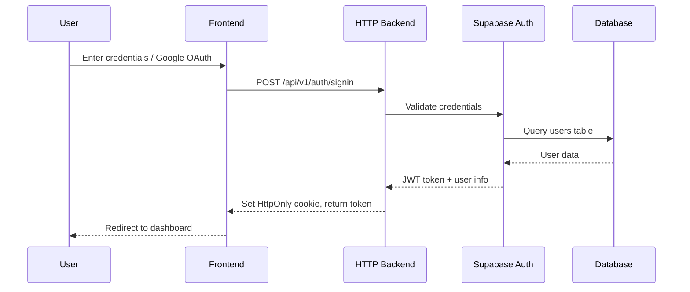
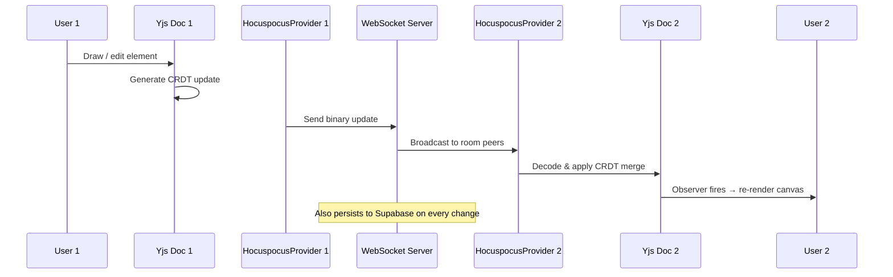
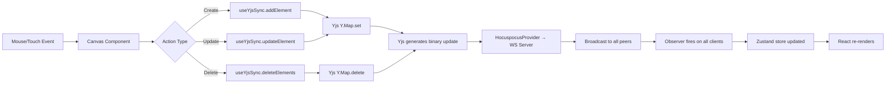
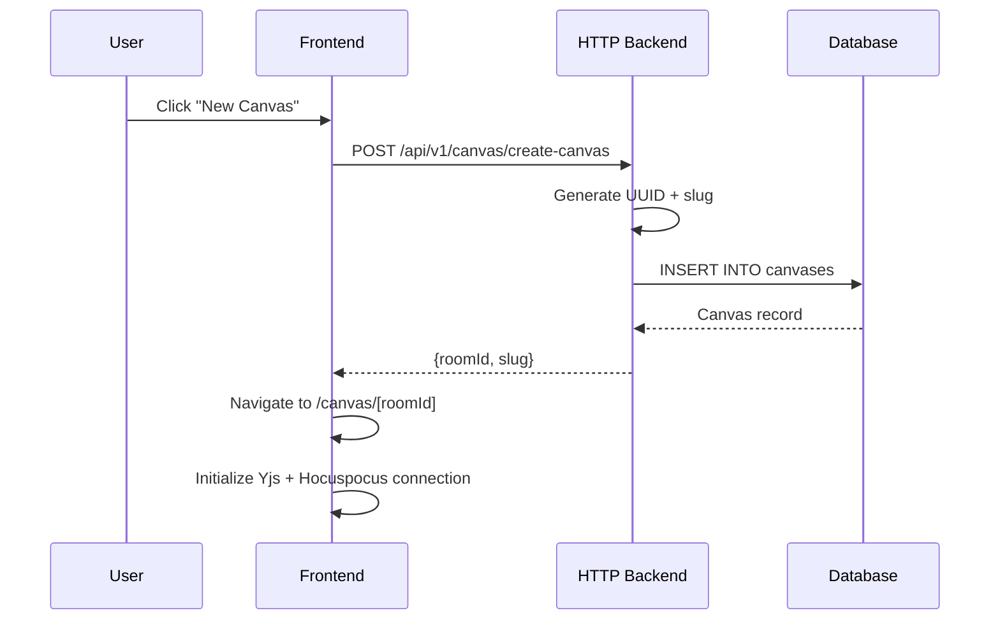
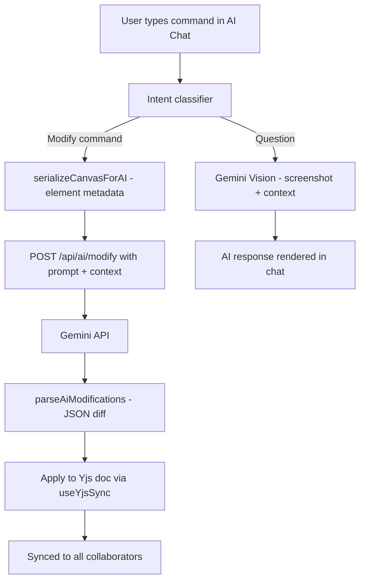

<p align="center">
  
</p>

<h1 align="center">LekhaFlow</h1>

<p align="center">
  <b>A real-time collaborative canvas platform built for teams</b>
</p>

<p align="center">
  <a href="#features">Features</a> •
  <a href="#architecture">Architecture</a> •
  <a href="#tech-stack">Tech Stack</a> •
  <a href="#local-setup-manual">Manual Setup</a> •
  <a href="#docker-setup">Docker Setup</a> •
  <a href="#api-documentation">API Docs</a> •
  <a href="#database-schema">Schema</a> •
  <a href="#testing">Testing</a> •
  <a href="#contributors">Contributors</a>
</p>

---

## About

**LekhaFlow** is an open-source, real-time collaborative whiteboard application inspired by Excalidraw. It enables multiple users to draw, sketch, and brainstorm on a shared canvas simultaneously with live cursor tracking, auto-save, and persistent storage.

Built as a monorepo using **Turborepo**, LekhaFlow comprises a **Next.js** frontend, an **Express** HTTP API server, and a **Hocuspocus** WebSocket server — all sharing common packages for types, configuration, and utilities.

> **Branch note:** Always pull from `dev` before working. All implemented features below are live on the `dev` branch.

---

## Features

### Drawing & Editing

| Category               | Feature                                                                                                |
| ---------------------- | ------------------------------------------------------------------------------------------------------ |
| **Drawing Tools**      | Rectangle, Ellipse, Diamond, Line, Arrow, Freehand draw, Text, Eraser, Laser pointer                   |
| **Element Operations** | Select, Move, Resize (8-handle), Rotate, Delete, Duplicate, Lock/unlock, Group transform               |
| **Styling**            | Fill color, Stroke color, Stroke width, Stroke style (solid/dashed/dotted), Opacity, Fill style        |
| **Canvas Controls**    | Infinite canvas pan, Zoom in/out/reset, Fit to screen, Grid toggle, Snap-to-grid                       |
| **Text**               | Rich text editing with inline formatting (bold, italic), multi-line text support                        |
| **Beautify**           | Convert rough freehand strokes into clean geometric shapes with one click (powered by shape recognition)|
| **Export**             | PNG, SVG, JSON export with customizable quality and background options                                  |
| **Import**             | Import from JSON scene files                                                                            |
| **UX**                 | Keyboard shortcuts, right-click context menu, help panel, undo/redo history, empty canvas hero          |

### Real-time Collaboration

| Feature                        | Description                                                                            |
| ------------------------------ | -------------------------------------------------------------------------------------- |
| **Multi-user canvas editing**  | Concurrent edits via Yjs CRDT — automatic conflict resolution, no data loss            |
| **Live collaborator cursors**  | See every connected user's cursor and name in real time                                |
| **Room-based chat**            | In-canvas chat panel for collaborators — messages persisted per room in Supabase       |
| **Connection status**          | Visual indicator for WebSocket connection state and sync status                        |
| **Awareness protocol**         | Broadcasts active selections and user identity across all peers                        |

### AI-Powered Features

| Feature                        | Description                                                                            |
| ------------------------------ | -------------------------------------------------------------------------------------- |
| **AI Chat Sidebar**            | Ask questions about your canvas — Google Gemini Vision analyzes the canvas screenshot and element metadata |
| **AI Canvas Modify**           | Natural-language commands to modify elements (e.g., "make the circle red", "resize the rectangle") applied directly on the canvas |
| **Diagram Intent Detection**   | Automatically identifies diagram types (flowchart, ER diagram, etc.) and shows a badge |
| **Ghost / Preview Layer**      | AI-generated element previews shown transparently before being committed to the canvas  |
| **AI Diagram Generation**      | Generate new diagram elements from text prompts via Gemini                              |

### Canvas Management & Organization

| Feature                        | Description                                                                            |
| ------------------------------ | -------------------------------------------------------------------------------------- |
| **Dashboard**                  | Grid/list view of all owned and shared canvases with thumbnails                        |
| **Folders**                    | Organize canvases into folders; folder CRUD operations                                  |
| **Tags**                       | Tag canvases for quick filtering and categorization                                     |
| **Trash**                      | Soft-delete with a dedicated trash view; restore or permanently delete                  |
| **Canvas sharing**             | Share via public link; toggle public/private visibility                                 |
| **Version history**            | Save named snapshots of canvas state; browse and restore any previous version           |
| **Recent canvases**            | Quick access list of recently opened canvases                                           |

### Authentication & Access Control

| Feature                          | Description                                                                          |
| -------------------------------- | ------------------------------------------------------------------------------------ |
| **Email/password auth**          | Signup, signin, email verification via Supabase Auth                                 |
| **Google OAuth**                 | One-click sign in with Google                                                        |
| **JWT session management**       | HTTP-only secure cookie, 7-day session, refresh token rotation                       |
| **Role-based access control**    | System-level roles (viewer / editor / admin) with per-canvas permission enforcement  |
| **Row Level Security**           | All database tables protected by Supabase RLS policies                               |

### Notifications

| Feature                          | Description                                                                          |
| -------------------------------- | ------------------------------------------------------------------------------------ |
| **In-app notification bell**     | Real-time notification indicator in the canvas header                                |
| **Notification types**           | mention, invite, comment, system                                                     |
| **Supabase Realtime**            | Notifications pushed instantly via Postgres Realtime subscription                    |
| **Read/unread state**            | Mark notifications as read; filtered views                                           |

---

## Architecture

### High-Level Architecture Diagram


```
┌──────────────────────────────────────────────────────┐
│               Browser (Next.js — Port 3000)           │
│  ┌──────────────┐  ┌──────────────┐  ┌────────────┐  │
│  │ Canvas +     │  │  Dashboard   │  │  Auth /    │  │
│  │ AI Sidebar   │  │  Folders     │  │  Login     │  │
│  │ Room Chat    │  │  Trash       │  │  OAuth     │  │
│  └──────┬───────┘  └──────────────┘  └─────┬──────┘  │
│         │  Yjs CRDT (binary)               │ HTTP/JWT  │
└─────────┼────────────────────────────────────┼────────┘
          │                                    │
          ▼                                    ▼
┌──────────────────┐                 ┌──────────────────┐
│  WebSocket Server│                 │  HTTP Backend    │
│  Hocuspocus      │                 │  Express v5      │
│  (Port 8080)     │                 │  (Port 8000)     │
│                  │                 │                  │
│  • Room sync     │                 │  • Auth routes   │
│  • Persistence   │                 │  • Canvas CRUD   │
│  • Auth check    │                 │  • Folders/Tags  │
│  • Awareness     │                 │  • Trash/Versions│
└────────┬─────────┘                 │  • RBAC / Notifs │
         │                           └────────┬─────────┘
         └──────────────┬────────────────────┘
                        ▼
              ┌──────────────────┐
              │    Supabase      │
              │  PostgreSQL +    │
              │  Auth + Realtime │
              └──────────────────┘
```

### System Data Flow Diagrams

#### Authentication Flow



#### Real-time Collaboration Flow



#### Element Synchronization Flow



#### Canvas Creation Flow



#### AI Modify Pipeline



### Use Case Diagram


### Entity Relationship Diagram


### Sequence Diagram — Real-time Collaboration Flow


---

## Tech Stack

| Layer                | Technology                                                                       |
| -------------------- | -------------------------------------------------------------------------------- |
| **Frontend**         | Next.js 16, React 19, TypeScript, Tailwind CSS, Zustand                          |
| **Canvas Rendering** | HTML5 Canvas via React Konva, Perfect Freehand, Rough.js                         |
| **Real-time Sync**   | Yjs (CRDT), Hocuspocus (WebSocket server & client provider)                      |
| **AI Integration**   | Google Gemini Vision API (multimodal - text + canvas screenshot)                 |
| **HTTP Backend**     | Express 5, Zod validation, http-status-codes                                     |
| **Database & Auth**  | Supabase (PostgreSQL + Auth + Realtime + Google OAuth)                           |
| **Monorepo Tooling** | Turborepo, pnpm workspaces                                                       |
| **Code Quality**     | Biome (linter + formatter), ESLint, Husky (pre-commit hooks)                     |
| **Testing**          | Vitest, React Testing Library, happy-dom                                         |
| **Containerization** | Docker, Docker Compose                                                            |
| **CI/CD**            | GitHub Actions (lint + build pipeline)                                           |

---

## Project Structure

```
canvas/                          # Monorepo root
├── apps/
│   ├── web/                     # Next.js frontend (port 3000)
│   │   ├── app/                 #   App router pages
│   │   │   ├── auth/callback/   #     OAuth callback handler
│   │   │   ├── canvas/[roomId]/ #     Canvas editor page
│   │   │   ├── login/           #     Login page
│   │   │   ├── rbac/            #     Role management page
│   │   │   └── api/             #     Next.js API routes (AI proxy)
│   │   ├── components/
│   │   │   ├── Canvas.tsx           #   Main canvas renderer
│   │   │   ├── Dashboard.tsx        #   Canvas management dashboard
│   │   │   ├── FolderView.tsx       #   Folder-based canvas view
│   │   │   ├── TrashView.tsx        #   Soft-deleted canvas view  
│   │   │   ├── CanvasAuthWrapper.tsx
│   │   │   └── canvas/              #   Canvas sub-components
│   │   │       ├── Toolbar.tsx
│   │   │       ├── Header.tsx
│   │   │       ├── PropertiesPanel.tsx
│   │   │       ├── ZoomControls.tsx
│   │   │       ├── CollaboratorCursors.tsx
│   │   │       ├── ConnectionStatus.tsx
│   │   │       ├── ContextMenu.tsx
│   │   │       ├── ExportModal.tsx
│   │   │       ├── HelpPanel.tsx
│   │   │       ├── RoomChat.tsx          #   In-canvas real-time chat
│   │   │       ├── AiChatSidebar.tsx     #   Gemini-powered AI assistant
│   │   │       ├── AiPreviewLayer.tsx    #   Ghost preview for AI edits
│   │   │       ├── BeautifyButton.tsx    #   Stroke → shape beautifier
│   │   │       ├── VersionsPanel.tsx     #   Version history & restore
│   │   │       ├── NotificationBell.tsx  #   Realtime notification bell
│   │   │       ├── ActivitySidebar.tsx   #   Activity feed
│   │   │       ├── GridLayer.tsx         #   Canvas grid rendering
│   │   │       ├── GroupTransformHandles.tsx
│   │   │       ├── RichTextEditor.tsx
│   │   │       ├── TextFormattingToolbar.tsx
│   │   │       ├── DiagramIntentBadge.tsx
│   │   │       ├── ResizeHandles.tsx
│   │   │       └── RotationControls.tsx
│   │   ├── hooks/
│   │   │   └── useYjsSync.ts    #   Yjs + Hocuspocus sync hook
│   │   ├── store/
│   │   │   └── canvas-store.ts  #   Zustand state management
│   │   ├── lib/
│   │   │   ├── element-utils.ts       #   Hit-testing, bounding box, transforms
│   │   │   ├── stroke-utils.ts        #   Freehand stroke processing
│   │   │   ├── beautify.ts            #   Stroke → shape recognition
│   │   │   ├── ai-modify-parser.ts    #   AI response → canvas diff parser
│   │   │   ├── canvas-serializer.ts   #   Serialize elements for AI context
│   │   │   ├── diagram-classifier.ts  #   Identify diagram type
│   │   │   ├── thumbnail.ts           #   Canvas thumbnail generation
│   │   │   └── rough-renderer.ts      #   Rough.js rendering utilities
│   │   └── test/                #   Frontend test suites
│   │
│   ├── http-backend/            # Express REST API (port 8000)
│   │   └── src/
│   │       ├── controller/      #   Route handlers
│   │       │   ├── auth.ts
│   │       │   ├── canvas.ts
│   │       │   ├── folder.ts
│   │       │   ├── tag.ts
│   │       │   ├── trash.ts
│   │       │   ├── version.ts
│   │       │   ├── notifications.ts
│   │       │   └── rbac.ts
│   │       ├── middleware/      #   JWT auth middleware
│   │       ├── routes/          #   Route definitions
│   │       ├── services/        #   Business logic layer
│   │       └── error/           #   Global error handler
│   │
│   └── ws-backend/              # Hocuspocus WebSocket server (port 8080)
│       └── src/
│           └── index.ts         #   Server config, DB persistence, auth
│
├── packages/                    # Shared packages
│   ├── common/                  #   Shared TypeScript types & Zod schemas
│   ├── config/                  #   Environment variable management
│   ├── http-core/               #   HTTP response utilities
│   ├── logger/                  #   Logging utilities
│   ├── supabase/                #   Supabase generated types
│   ├── ui/                      #   Shared UI components
│   ├── eslint-config/           #   Shared ESLint configs
│   └── typescript-config/       #   Shared tsconfig presets
│
├── bruno/                       # API testing collection (Bruno)
├── docker-compose.yml           # Local Docker Compose
├── docker-compose.production.yml# Production Docker Compose overlay
├── turbo.json                   # Turborepo pipeline config
├── pnpm-workspace.yaml          # Workspace definition
└── biome.json                   # Biome linter/formatter config
```

---

## Local Setup (Manual)

### Prerequisites

| Tool                 | Version           |
| -------------------- | ------------------|
| **Node.js**          | ≥ 18              |
| **pnpm**             | ≥ 10.28.0         |
| **Git**              | Latest            |
| **Supabase Project** | [Create one →](https://supabase.com/dashboard) |

### 1. Clone & switch to dev branch

```bash
git clone https://github.com/anusanth26/LekhaFlow.git
cd LekhaFlow/canvas
git checkout dev
git pull origin dev
```

### 2. Install dependencies

```bash
pnpm install
```

### 3. Set up environment variables

Create a `.env` file in the `canvas/` directory:

```env
# ── Server-side (http-backend & ws-backend) ──
SUPABASE_URL="https://your-project.supabase.co"
SUPABASE_SERVICE_KEY="your_service_role_key"
NODE_ENV="development"
WS_PORT="8080"

# ── Client-side (Next.js) ──
NEXT_PUBLIC_SUPABASE_URL="https://your-project.supabase.co"
NEXT_PUBLIC_SUPABASE_ANON_KEY="your_anon_key"
NEXT_PUBLIC_WS_URL="ws://localhost:8080"
NEXT_PUBLIC_HTTP_URL="http://localhost:8000"

# ── AI features ──
GEMINI_API_KEY="your_gemini_api_key"
```

> Get your Supabase keys from: **Supabase Dashboard → Settings → API**  
> Get a Gemini API key from: [Google AI Studio](https://aistudio.google.com/app/apikey)

### 4. Set up the database (Supabase SQL Editor)

Run each of the following SQL scripts in order via your **Supabase SQL Editor**:

#### Core tables

```sql
-- Users table (synced from Supabase Auth)
CREATE TABLE IF NOT EXISTS public.users (
    id UUID PRIMARY KEY REFERENCES auth.users(id),
    email TEXT NOT NULL,
    name TEXT,
    avatar_url TEXT,
    created_at TIMESTAMPTZ DEFAULT NOW(),
    updated_at TIMESTAMPTZ DEFAULT NOW()
);

-- Canvases table
CREATE TABLE IF NOT EXISTS public.canvases (
    id UUID PRIMARY KEY DEFAULT gen_random_uuid(),
    name TEXT NOT NULL,
    slug TEXT UNIQUE NOT NULL,
    owner_id UUID NOT NULL REFERENCES public.users(id) ON DELETE CASCADE,
    data TEXT,
    thumbnail_url TEXT,
    is_public BOOLEAN DEFAULT FALSE,
    is_deleted BOOLEAN DEFAULT FALSE,
    created_at TIMESTAMPTZ DEFAULT NOW(),
    updated_at TIMESTAMPTZ DEFAULT NOW()
);

CREATE INDEX IF NOT EXISTS idx_canvases_owner_id ON public.canvases(owner_id);
CREATE INDEX IF NOT EXISTS idx_canvases_slug ON public.canvases(slug);

ALTER TABLE public.users ENABLE ROW LEVEL SECURITY;
ALTER TABLE public.canvases ENABLE ROW LEVEL SECURITY;

CREATE POLICY "Users can view own canvases" ON public.canvases FOR SELECT
    USING (auth.uid() = owner_id OR is_public = true);
CREATE POLICY "Users can insert own canvases" ON public.canvases FOR INSERT
    WITH CHECK (auth.uid() = owner_id);
CREATE POLICY "Users can update own canvases" ON public.canvases FOR UPDATE
    USING (auth.uid() = owner_id);
CREATE POLICY "Users can delete own canvases" ON public.canvases FOR DELETE
    USING (auth.uid() = owner_id);
```

#### Activity logs

```sql
CREATE TABLE IF NOT EXISTS public.activity_logs (
    id UUID PRIMARY KEY DEFAULT gen_random_uuid(),
    canvas_id UUID REFERENCES public.canvases(id),
    user_id UUID REFERENCES public.users(id),
    action TEXT NOT NULL,
    details JSONB,
    created_at TIMESTAMPTZ DEFAULT NOW()
);
ALTER TABLE public.activity_logs ENABLE ROW LEVEL SECURITY;
```

#### Room chat

```sql
CREATE TABLE IF NOT EXISTS public.room_chat (
    id UUID PRIMARY KEY DEFAULT uuid_generate_v4(),
    canvas_id UUID NOT NULL REFERENCES public.canvases(id) ON DELETE CASCADE,
    user_id UUID NOT NULL REFERENCES public.users(id) ON DELETE CASCADE,
    content TEXT NOT NULL,
    created_at TIMESTAMPTZ DEFAULT NOW(),
    updated_at TIMESTAMPTZ DEFAULT NOW()
);
CREATE INDEX IF NOT EXISTS idx_room_chat_canvas_id ON public.room_chat(canvas_id);
ALTER TABLE public.room_chat ENABLE ROW LEVEL SECURITY;
CREATE POLICY "Users can view messages" ON public.room_chat FOR SELECT TO authenticated USING (true);
CREATE POLICY "Users can send messages" ON public.room_chat FOR INSERT TO authenticated WITH CHECK (auth.uid() = user_id);
ALTER PUBLICATION supabase_realtime ADD TABLE public.room_chat;
```

#### Notifications

```sql
CREATE TYPE notification_type AS ENUM ('mention', 'invite', 'system', 'comment');

CREATE TABLE IF NOT EXISTS public.notifications (
    id UUID PRIMARY KEY DEFAULT gen_random_uuid(),
    user_id UUID NOT NULL REFERENCES public.users(id) ON DELETE CASCADE,
    actor_id UUID REFERENCES public.users(id) ON DELETE SET NULL,
    canvas_id UUID REFERENCES public.canvases(id) ON DELETE CASCADE,
    type notification_type NOT NULL,
    content TEXT NOT NULL,
    is_read BOOLEAN NOT NULL DEFAULT FALSE,
    created_at TIMESTAMPTZ DEFAULT NOW()
);
ALTER TABLE public.notifications ENABLE ROW LEVEL SECURITY;
CREATE POLICY "Users can view their own notifications" ON public.notifications FOR SELECT
    USING (auth.uid() = user_id);
CREATE POLICY "Users can update their own notifications" ON public.notifications FOR UPDATE
    USING (auth.uid() = user_id) WITH CHECK (auth.uid() = user_id);
ALTER PUBLICATION supabase_realtime ADD TABLE public.notifications;
```

#### RBAC (Roles)

```sql
CREATE TABLE IF NOT EXISTS public.roles (
    id UUID PRIMARY KEY DEFAULT uuid_generate_v4(),
    name TEXT UNIQUE NOT NULL,
    description TEXT,
    level INTEGER NOT NULL DEFAULT 0,
    created_at TIMESTAMPTZ DEFAULT NOW()
);
INSERT INTO public.roles (name, description, level) VALUES
    ('viewer', 'Can only view canvases', 10),
    ('editor', 'Can view and edit canvases', 50),
    ('admin', 'Full access to room management & users', 100)
ON CONFLICT (name) DO NOTHING;

CREATE TABLE IF NOT EXISTS public.user_roles (
    user_id UUID NOT NULL REFERENCES public.users(id) ON DELETE CASCADE,
    role_id UUID NOT NULL REFERENCES public.roles(id) ON DELETE CASCADE,
    assigned_at TIMESTAMPTZ DEFAULT NOW(),
    assigned_by UUID REFERENCES public.users(id) ON DELETE SET NULL,
    PRIMARY KEY (user_id, role_id)
);
ALTER TABLE public.roles ENABLE ROW LEVEL SECURITY;
ALTER TABLE public.user_roles ENABLE ROW LEVEL SECURITY;
CREATE POLICY "Anyone can view roles" ON public.roles FOR SELECT TO authenticated USING (true);
CREATE POLICY "Anyone can view user roles" ON public.user_roles FOR SELECT TO authenticated USING (true);
```

### 5. Configure Google OAuth (optional)

1. Go to **Supabase Dashboard → Authentication → Providers → Google**
2. Enable the Google provider and add your OAuth Client ID and Secret
3. Set the redirect URL: `http://localhost:3000/auth/callback`

### 6. Start all services

```bash
# From canvas/ directory
pnpm dev
```

| Service       | URL                     | Description                        |
| ------------- | ----------------------- | ---------------------------------- |
| **Web App**   | `http://localhost:3000` | Next.js frontend                   |
| **HTTP API**  | `http://localhost:8000` | Express REST API                   |
| **WebSocket** | `ws://localhost:8080`   | Hocuspocus real-time collaboration |

### Available Scripts

| Command              | Description                                |
| -------------------- | ------------------------------------------ |
| `pnpm dev`           | Start all services in development mode     |
| `pnpm build`         | Build all packages and apps                |
| `pnpm lint`          | Run linting across all packages            |
| `pnpm check`         | Run Biome checks with auto-fix             |
| `pnpm format`        | Format code with Biome                     |
| `pnpm check-types`   | TypeScript type checking across monorepo   |
| `pnpm test`          | Run all test suites                        |

---

## Docker Setup

Docker Compose runs all three services (frontend, HTTP backend, WebSocket backend) and connects them to Supabase. There is **no local database container** — you still need a Supabase project for auth and storage.

### Prerequisites

- [Docker Desktop](https://www.docker.com/products/docker-desktop/) installed and running
- A Supabase project (same as manual setup — see [step 3–5 above](#3-set-up-environment-variables))

### 1. Create `.env.docker` in `canvas/`

```env
# Supabase (server-side)
SUPABASE_URL="https://your-project.supabase.co"
SUPABASE_SERVICE_KEY="your_service_role_key"

# Supabase (client-side / build-time)
NEXT_PUBLIC_SUPABASE_URL="https://your-project.supabase.co"
NEXT_PUBLIC_SUPABASE_ANON_KEY="your_anon_key"

# Service URLs (for inter-container communication use container names)
NEXT_PUBLIC_WS_URL="ws://localhost:8080"
NEXT_PUBLIC_HTTP_URL="http://localhost:8000"

# AI
GEMINI_API_KEY="your_gemini_api_key"

NODE_ENV="production"
WS_PORT="8080"
```

### 2. Build and start containers

```bash
# From canvas/ directory
docker compose --env-file .env.docker up --build
```

This builds Docker images for all three services and starts them:

| Container      | Port | Description              |
| -------------- | ---- | ------------------------ |
| `web`          | 3000 | Next.js frontend         |
| `http-backend` | 8000 | Express REST API         |
| `ws-backend`   | 8080 | Hocuspocus WS server     |

### 3. Verify containers are running

```bash
docker compose ps
```

Open `http://localhost:3000` in your browser.

### 4. Stop containers

```bash
docker compose down
```

### Running individual services

```bash
# Rebuild and restart a single service (e.g., after code changes)
docker compose --env-file .env.docker up --build web
```

### Production Docker (pre-built images)

For production, use the override file which pulls pre-built images from GHCR instead of building locally:

```bash
docker compose \
  -f docker-compose.yml \
  -f docker-compose.production.yml \
  --env-file .env.docker \
  up -d
```

---

## API Documentation

**Base URL:** `http://localhost:8000/api/v1`

All 🔒 endpoints require the header:

```
Authorization: Bearer <supabase_jwt_token>
```

### Authentication Endpoints

| Method | Endpoint             | Auth | Description                                     |
| ------ | -------------------- | ---- | ----------------------------------------------- |
| `POST` | `/auth/signup`       | —    | Register a new user (email + password + name)   |
| `POST` | `/auth/signin`       | —    | Sign in; sets `access_token` HttpOnly cookie    |
| `GET`  | `/auth/me`           | 🔒   | Get current user profile                        |
| `POST` | `/auth/sync-user`    | 🔒   | Upsert OAuth user profile into `users` table    |

#### `POST /auth/signup`

```json
// Request
{ "email": "user@example.com", "password": "securepassword", "name": "John Doe" }

// Response 201
{ "status": 201, "message": "User created successfully. Check email for verification.", "data": { "user": { "id": "uuid", "email": "user@example.com" } } }
```

#### `POST /auth/signin`

```json
// Request
{ "email": "user@example.com", "password": "securepassword" }

// Response 200 — also sets HttpOnly cookie `access_token` (7-day expiry)
{ "status": 200, "message": "Signed in successfully", "data": { "user": { ... }, "token": "eyJ..." } }
```

---

### Canvas Endpoints

| Method   | Endpoint                    | Auth | Description                                |
| -------- | --------------------------- | ---- | ------------------------------------------ |
| `POST`   | `/canvas/create-canvas`     | 🔒   | Create a new canvas                        |
| `GET`    | `/canvas`                   | 🔒   | List all accessible canvases               |
| `GET`    | `/canvas/recent`            | 🔒   | Get recently opened canvases               |
| `GET`    | `/canvas/:roomId`           | 🔒   | Get a specific canvas                      |
| `PUT`    | `/canvas/:roomId`           | 🔒   | Update canvas name / data (owner only)     |
| `DELETE` | `/canvas/:roomId`           | 🔒   | Soft-delete a canvas (owner only)          |

#### `POST /canvas/create-canvas`

```json
// Request
{ "name": "My Whiteboard", "isPublic": false }

// Response 201
{ "status": 201, "message": "Canvas created successfully", "data": { "roomId": "uuid", "slug": "my-whiteboard-..." } }
```

---

### Folder Endpoints

| Method   | Endpoint               | Auth | Description                  |
| -------- | ---------------------- | ---- | ---------------------------- |
| `POST`   | `/folder`              | 🔒   | Create a new folder           |
| `GET`    | `/folder`              | 🔒   | List all folders for the user |
| `PUT`    | `/folder/:folderId`    | 🔒   | Rename a folder               |
| `DELETE` | `/folder/:folderId`    | 🔒   | Delete a folder               |
| `POST`   | `/folder/:folderId/canvas/:canvasId` | 🔒 | Move canvas into folder |

---

### Tag Endpoints

| Method   | Endpoint                | Auth | Description                     |
| -------- | ----------------------- | ---- | ------------------------------- |
| `POST`   | `/tag`                  | 🔒   | Create a tag                     |
| `GET`    | `/tag`                  | 🔒   | List all tags for the user       |
| `DELETE` | `/tag/:tagId`           | 🔒   | Delete a tag                     |
| `POST`   | `/tag/:tagId/canvas/:canvasId` | 🔒 | Attach tag to canvas        |
| `DELETE` | `/tag/:tagId/canvas/:canvasId` | 🔒 | Remove tag from canvas      |

---

### Trash Endpoints

| Method   | Endpoint               | Auth | Description                       |
| -------- | ---------------------- | ---- | --------------------------------- |
| `GET`    | `/trash`               | 🔒   | List soft-deleted canvases         |
| `POST`   | `/trash/:canvasId/restore` | 🔒 | Restore a canvas from trash      |
| `DELETE` | `/trash/:canvasId`     | 🔒   | Permanently delete a canvas        |

---

### Version Endpoints

| Method   | Endpoint                   | Auth | Description                      |
| -------- | -------------------------- | ---- | -------------------------------- |
| `POST`   | `/canvas/:roomId/version`  | 🔒   | Save a named version snapshot     |
| `GET`    | `/canvas/:roomId/versions` | 🔒   | List all saved versions           |
| `POST`   | `/canvas/:roomId/version/:versionId/restore` | 🔒 | Restore to a version |

---

### Notification Endpoints

| Method | Endpoint                    | Auth | Description                           |
| ------ | --------------------------- | ---- | ------------------------------------- |
| `GET`  | `/notifications`            | 🔒   | Get all notifications for the user    |
| `PUT`  | `/notifications/:id/read`   | 🔒   | Mark a notification as read           |
| `PUT`  | `/notifications/read-all`   | 🔒   | Mark all notifications as read        |

---

### RBAC Endpoints

| Method | Endpoint                    | Auth | Description                             |
| ------ | --------------------------- | ---- | --------------------------------------- |
| `GET`  | `/rbac/roles`               | 🔒   | List all system roles                   |
| `GET`  | `/rbac/users`               | 🔒   | List all users with their roles         |
| `POST` | `/rbac/assign`              | 🔒   | Assign a role to a user (admin only)    |
| `DELETE` | `/rbac/revoke`            | 🔒   | Revoke a role from a user (admin only)  |

---

### API Error Responses

All errors follow a consistent format:

```json
{
  "status": 400,
  "message": "Validation Failed: Invalid input"
}
```

| Status Code | Meaning                                          |
| ----------- | ------------------------------------------------ |
| `400`       | Bad Request — validation error or missing fields |
| `401`       | Unauthorized — missing or invalid JWT token      |
| `403`       | Forbidden — not the resource owner              |
| `404`       | Not Found — resource does not exist              |
| `500`       | Internal Server Error                            |

---

### WebSocket API (Real-time Collaboration)

**URL:** `ws://localhost:8080`

LekhaFlow uses the [Hocuspocus](https://tiptap.dev/hocuspocus) protocol built on **Yjs CRDT** for conflict-free real-time collaboration.

**Client Connection Example:**

```typescript
import { HocuspocusProvider } from "@hocuspocus/provider";
import * as Y from "yjs";

const ydoc = new Y.Doc();
const provider = new HocuspocusProvider({
  url: "ws://localhost:8080",
  name: roomId, // Canvas UUID used as document name
  document: ydoc,
  token: jwtToken, // Supabase JWT for authentication
});

const elementsMap = ydoc.getMap("elements");

provider.awareness.setLocalState({
  user: { id: "...", name: "...", color: "#..." },
  cursor: { x: 100, y: 200 },
});
```

**Protocol Events:**

| Event            | Description                                                      |
| ---------------- | ---------------------------------------------------------------- |
| `onAuthenticate` | Validates JWT against Supabase, logs canvas access               |
| `fetch`          | Loads persisted Yjs binary state from `canvases.data` column     |
| `store`          | Auto-saves Yjs binary state to Supabase on every document change |
| `awareness`      | Broadcasts cursor positions, user identities, active selections  |

---

## Database Schema

### Entity Relationship Diagram


### Tables

| Table            | Purpose                                                   |
| ---------------- | --------------------------------------------------------- |
| `users`          | User profiles synced from Supabase Auth                   |
| `canvases`       | Canvas documents — stores Yjs binary state                |
| `activity_logs`  | Audit trail of canvas access and actions                  |
| `room_chat`      | Per-canvas chat messages (Realtime enabled)               |
| `notifications`  | User notifications (mention/invite/comment/system)        |
| `roles`          | System roles: viewer, editor, admin                       |
| `user_roles`     | Many-to-many user ↔ role assignments                      |

**`canvases`** — Key columns:

| Column        | Type          | Description                                              |
| ------------- | ------------- | -------------------------------------------------------- |
| `id`          | UUID (PK)     | Used as the Hocuspocus `documentName` and WebSocket room |
| `name`        | TEXT          | User-facing canvas name                                  |
| `slug`        | TEXT (UNIQUE) | URL-friendly identifier                                  |
| `owner_id`    | UUID (FK)     | References `users.id`                                    |
| `data`        | TEXT          | Hex-encoded Yjs CRDT binary state (auto-saved)           |
| `thumbnail_url` | TEXT        | Canvas preview image URL                                 |
| `is_public`   | BOOLEAN       | Public sharing flag                                      |
| `is_deleted`  | BOOLEAN       | Soft delete flag (true = in trash)                       |

**`notifications`** — Realtime-enabled:

| Column      | Type                   | Description                                        |
| ----------- | ---------------------- | -------------------------------------------------- |
| `type`      | ENUM                   | `mention`, `invite`, `comment`, `system`           |
| `user_id`   | UUID (FK)              | Recipient                                          |
| `actor_id`  | UUID (FK, nullable)    | User who triggered the notification                |
| `canvas_id` | UUID (FK, nullable)    | Related canvas                                     |
| `is_read`   | BOOLEAN                | Read state                                         |

---

## State Management

LekhaFlow uses **Zustand** for client-side state management:

```
┌─────────────────────────────────────────────────────────────┐
│                       CANVAS STORE                           │
├─────────────────────────────────────────────────────────────┤
│  Elements State        UI State              Collaborators   │
│  elements[]            activeTool            users[]         │
│  selectedIds           strokeColor           isConnected     │
│  undoStack/redoStack   bgColor / opacity     isSynced        │
│                        isAiChatOpen          roomId          │
│                        isVersionsPanelOpen                   │
├─────────────────────────────────────────────────────────────┤
│  Actions: addElement, updateElement, deleteElement,          │
│           setTool, undo, redo, selectAll, setAiChatOpen, …  │
└─────────────────────────────────────────────────────────────┘
```

**Data Flow:** User action → `useYjsSync` → Yjs Y.Map → Hocuspocus → broadcast → Yjs observer → Zustand → React re-render.

---

## Testing

LekhaFlow includes comprehensive test coverage across all layers.

```bash
# Run all tests across the monorepo
pnpm test

# Frontend tests in watch mode
cd canvas/apps/web && pnpm test:watch

# Run a specific suite
cd canvas/apps/web && pnpm vitest run test/canvas-store.test.ts

# Backend tests
cd canvas/apps/http-backend && pnpm test
cd canvas/apps/ws-backend && pnpm test
```

### Test Suites

| Suite                    | Location                                            | Coverage                                               |
| ------------------------ | --------------------------------------------------- | ------------------------------------------------------ |
| **Canvas Store**         | `apps/web/test/canvas-store.test.ts`                | UI state, element CRUD, bulk actions, undo/redo        |
| **Element Utilities**    | `apps/web/test/element-utils.test.ts`               | Hit-testing, bounding box, point transforms            |
| **Yjs Sync Hook**        | `apps/web/test/useYjsSync.test.ts`                  | Connection lifecycle, awareness, document updates      |
| **UI Integration**       | `apps/web/test/ui-integration.test.tsx`             | Toolbar, zoom controls, auth flows, keyboard shortcuts |
| **Beautify Library**     | `apps/web/lib/beautify.test.ts`                     | Stroke → shape recognition, edge cases                 |
| **Canvas API**           | `apps/http-backend/src/controller/canvas.test.ts`   | Canvas creation, authorization checks                  |
| **Folder Controller**    | `apps/http-backend/src/controller/folder.test.ts`   | Folder CRUD, ownership validation                      |
| **Tag Controller**       | `apps/http-backend/src/controller/tag.test.ts`      | Tag creation, canvas association                       |
| **Trash Controller**     | `apps/http-backend/src/controller/trash.test.ts`    | Soft-delete, restore, permanent delete                 |
| **WS Persistence**       | `apps/ws-backend/test/database.test.ts`             | Fetch/store lifecycle, binary encoding                 |

---

## Keyboard Shortcuts

| Shortcut                        | Action                   |
| ------------------------------- | ------------------------ |
| `V`                             | Selection tool           |
| `R`                             | Rectangle                |
| `O`                             | Ellipse                  |
| `D`                             | Diamond                  |
| `L`                             | Line                     |
| `A`                             | Arrow                    |
| `P`                             | Freehand draw            |
| `T`                             | Text                     |
| `H`                             | Hand (pan)               |
| `B`                             | Beautify selected strokes|
| `Delete` / `Backspace`          | Delete selected elements |
| `Ctrl + Z`                      | Undo                     |
| `Ctrl + Y` / `Ctrl + Shift + Z` | Redo                     |
| `Ctrl + A`                      | Select all               |
| `Ctrl + D`                      | Duplicate selected       |
| `Ctrl + +` / `Ctrl + -`         | Zoom in / out            |
| `Ctrl + 0`                      | Reset zoom to 100%       |
| `?`                             | Toggle help panel        |

---

## API Testing with Bruno

The project includes a [Bruno](https://www.usebruno.com/) collection for API testing:

```
canvas/bruno/
├── SignUp.bru            # Register a new user
├── SignIn.bru            # Sign in and get JWT
├── SignIn_New.bru        # Alternate sign in
├── CreateCanvas.bru      # Create a new canvas
├── UpdateCanvas.bru      # Update canvas
└── LekhaFlow/            # Environment & workspace config
```

Import the `canvas/bruno/` folder into Bruno and run requests against `http://localhost:8000`.

---

## Contributors

<table>
  <tr>
    <td align="center">
      <a href="https://github.com/Ananthakrishnan-47">
        
        <br />
        <sub><b>Ananthakrishnan-47</b></sub>
      </a>
    </td>
     <td align="center">
      <a href="https://github.com/anusanth26">
        
        <br />
        <sub><b>anusanth26</b></sub>
      </a>
    </td>
    <td align="center">
      <a href="https://github.com/Rishiikesh-20">
        
        <br />
        <sub><b>Rishiikesh-20</b></sub>
      </a>
    </td>
    <td align="center">
      <a href="https://github.com/Goldmauler">
        
        <br />
        <sub><b>Goldmauler</b></sub>
      </a>
    </td>
    <td align="center">
      <a href="https://github.com/Jeevan0814">
        
        <br />
        <sub><b>Jeevan0814</b></sub>
      </a>
    </td>
  </tr>
</table>

---


<p align="center">Built with ❤️ by the LekhaFlow team</p>
